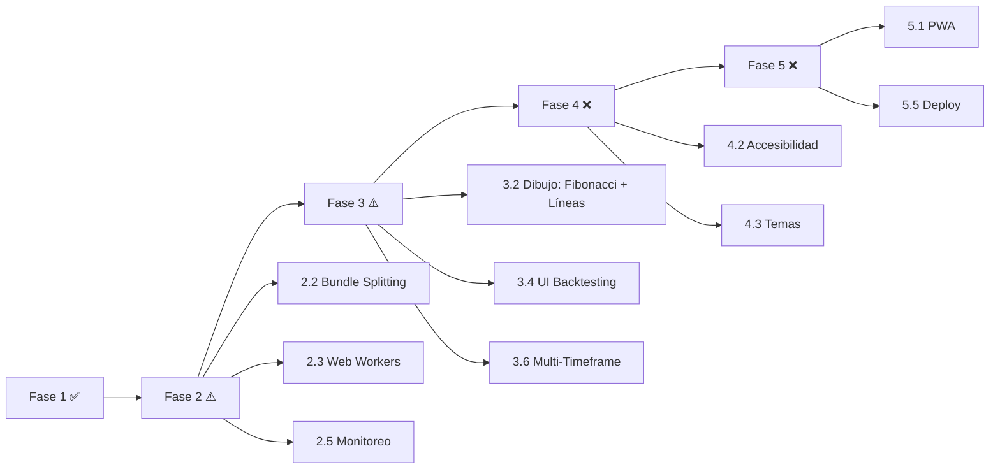

# 📋 Roadmap del proyecto TradingView Personal

## Visión General — 5 Fases

| Fase | Nombre | Estado | Progreso Real |
|------|--------|--------|---------------|
| 1 | Seguridad | ✅ Completada | 100% (3/3 subfases) |
| 2 | Rendimiento y Escalabilidad | ⚠️ Parcial | 5% (1/19 items) |
| 3 | Funcionalidades Avanzadas | ⚠️ Parcial | ~40% (core hecho, UI pendiente) |
| 4 | UX/UI y Accesibilidad | ❌ No iniciada | 0% (0/27 items) |
| 5 | PWA y Mobile | ❌ No iniciada | 0% (0/28 items) |

---

## Fase 1: Seguridad — ✅ COMPLETADA

### Subfase 1.1 – Refuerzo de API Proxy
- ✅ Validación estricta de endpoints (lista blanca) en `src/app/api/binance/[...path]/route.ts`.
- ✅ Sanitización y validación de parámetros (símbolos, intervalos, límites, batch).
- ✅ Implementación de rate‑limiting en memoria (100 peticiones/min por IP).
- ✅ Manejo de errores con respuestas genéricas en producción y logs detallados en desarrollo.
- ✅ Cabecera `Cache‑Control` adecuada para datos públicos.

### Subfase 1.2 – Autenticación y Validación WebSocket
- ✅ Expresión regular para símbolos Binance (`^[A-Z0-9]{2,20}USDT$`).
- ✅ Validación de `Timeframe` contra lista permitida.
- ✅ Autenticación opcional mediante token (`WS_TOKEN`).
- ✅ Rate‑limiting de suscripciones (máx. 10 por IP).
- ✅ Validación de la estructura de mensajes antes de procesar.
- ✅ Mensajes de advertencia (`logger.warn`) en caso de datos incompletos.

### Subfase 1.3 – Logging y Monitoreo
- ✅ Creación de utilidad de logging centralizada (`src/lib/logger.ts`) con niveles `info`, `warn` y `error`.
- ✅ Reemplazo de `console.error` por `logger.error` en puntos críticos del código.
- ✅ Preparación para integrar un servicio de monitoreo externo (Sentry, Datadog) en el futuro.

> Ver detalle en [`roadmap-phase2.md`](roadmap-phase2.md)

---

## Fase 2: Rendimiento y Escalabilidad — ⚠️ PARCIAL

| Subfase | Estado |
|---------|--------|
| 2.1 Cache y Optimización | ⚠️ 25% — SWR implementado, falta config avanzada |
| 2.2 Bundle Splitting | ❌ 0% — Sin dynamic imports, sin React.lazy |
| 2.3 Web Workers | ❌ 0% — Sin workers para cálculos |
| 2.4 Escalado WebSocket | ❌ 0% — Sin pool, sin IndexedDB |
| 2.5 Monitoreo Rendimiento | ❌ 0% — Sin web-vitals, sin analytics |

> Ver detalle en [`roadmap-phase2.md`](roadmap-phase2.md)

---

## Fase 3: Funcionalidades Avanzadas — ⚠️ PARCIAL

| Subfase | Estado |
|---------|--------|
| 3.1 Indicadores Avanzados | ⚠️ 80% — Indicadores hechos, UI alertas por cruce pendiente |
| 3.2 Herramientas de Dibujo | ⚠️ 20% — Solo MeasureOverlay, falta Fibonacci/líneas/formas |
| 3.3 Alertas y Notificaciones | ⚠️ 60% — Store + hook hechos, falta Push y UI desde gráfico |
| 3.4 Backtesting | ⚠️ 50% — Motor hecho, falta UI y estrategias personalizadas |
| 3.5 Exportación Datos | ⚠️ 50% — CSV/JSON hecho, falta export imagen y API pública |
| 3.6 Multi-Timeframe | ❌ 0% — Sin implementación |

> Ver detalle en [`roadmap-phase3.md`](roadmap-phase3.md)

---

## Fase 4: UX/UI y Accesibilidad — ❌ NO INICIADA

| Subfase | Descripción |
|---------|-------------|
| 4.1 Diseño Responsive | Layout adaptativo tablets, sidebar colapsable |
| 4.2 Accesibilidad (a11y) | ARIA, keyboard nav, WCAG 2.1 AA, screen reader |
| 4.3 Temas y Personalización | Dark/light, colores gráfico, layout guardable |
| 4.4 Onboarding y Tooltips | Tutorial guiado, atajos teclado, badges |
| 4.5 Internacionalización | next-intl, ES/EN, formato locale |

> Ver detalle en [`roadmap-phase4.md`](roadmap-phase4.md)

---

## Fase 5: PWA y Mobile — ❌ NO INICIADA

| Subfase | Descripción |
|---------|-------------|
| 5.1 PWA Manifest | Service Worker, manifest.json, install prompt |
| 5.2 Layout Mobile | Bottom nav, gestos touch, full-screen chart |
| 5.3 Push Notifications | Web Push API, VAPID, integración alert-store |
| 5.4 Offline y Sync | Cache SW, IndexedDB, Background Sync |
| 5.5 Deploy y CI/CD | Vercel, preview deploys, health check, Sentry |

> Ver detalle en [`roadmap-phase5.md`](roadmap-phase5.md)

---

## Orden de Ejecución Recomendado

### Prioridades Inmediatas
1. **Fase 2.2** — Bundle Splitting (mayor impacto en performance con menor esfuerzo)
2. **Fase 3.2** — Herramientas de dibujo (Fibonacci, líneas de tendencia)
3. **Fase 3.4** — UI de Backtesting (el motor ya funciona, falta la interfaz)
4. **Fase 4.2** — Accesibilidad (base para todo lo demás)
5. **Fase 5.1** — PWA Manifest (permite instalación como app)
