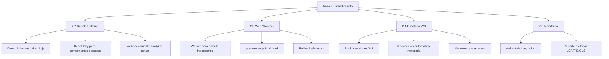

# 🔍 Auditoría Completa del Roadmap — MiuraTrade

## Resumen Ejecutivo

Los roadmaps existentes marcan muchas cosas como ✅ que **NO están implementadas** en el código. A continuación, el estado REAL de cada fase, qué falta, y la propuesta para las Fases 4 y 5 que aún no tienen documento.

---

## Fase 1: Seguridad — ✅ COMPLETADA (real)

| Subfase | Estado Real | Notas |
|---------|-------------|-------|
| 1.1 Refuerzo API Proxy | ✅ Real | Validación, sanitización, rate-limiting, cache headers — todo en `route.ts` |
| 1.2 Auth y Validación WS | ✅ Real | Regex símbolos, validación timeframes, rate-limit suscripciones en `ws.ts` |
| 1.3 Logging y Monitoreo | ✅ Real | `logger.ts` con niveles info/warn/error |

**Veredicto**: Fase 1 genuinamente completa. Los tests de seguridad pasan.

---

## Fase 2: Rendimiento y Escalabilidad — ⚠️ PARCIALMENTE IMPLEMENTADA

| Subfase | Roadmap dice | Estado REAL | Evidencia |
|---------|-------------|-------------|-----------|
| 2.1 Cache y Optimización | ✅ | ⚠️ Parcial | SWR instalado y usado en `useMarketData.ts` ✅. Pero NO hay `revalidateOnFocus: false` configurable, NO hay `next/image`, NO hay `loading="lazy"` |
| 2.2 Bundle Splitting | ✅ | ❌ No implementado | NO hay `React.lazy`, NO hay `Suspense`, NO hay `import()` dinámico para oakscriptjs/lightweight-charts, NO hay webpack-bundle-analyzer |
| 2.3 Web Workers | ✅ | ❌ No implementado | NO hay Web Workers, NO hay `postMessage`, NO hay fallback síncrono, NO hay caché con `maxAge` |
| 2.4 Escalado WebSocket | ✅ | ❌ No implementado | NO hay pool de conexiones WS, NO hay `worker_threads`, NO hay persistencia en IndexedDB, NO hay monitoreo de conexiones activas |
| 2.5 Monitoreo Rendimiento | ✅ | ❌ No implementado | NO hay `web-vitals`, NO hay Plausible, NO hay alertas de rendimiento |

**Veredicto**: De 5 subfases, solo 2.1 está parcialmente hecha (SWR existe). Las subfases 2.2–2.5 están **sin implementar**.

---

## Fase 3: Funcionalidades Avanzadas — ⚠️ PARCIALMENTE IMPLEMENTADA

| Subfase | Estado Real | Detalle |
|---------|-------------|---------|
| 3.1 Indicadores Avanzados | ⚠️ Parcial | ✅ RSI, MACD, BB, Estocástico, oakscript indicators. ⬜ Alertas por cruce de indicadores (UI) |
| 3.2 Herramientas de Dibujo | ⚠️ Parcial | ✅ MeasureOverlay. ⬜ Líneas tendencia, canales, Fibonacci, formas, texto, guardado localStorage |
| 3.3 Alertas y Notificaciones | ⚠️ Parcial | ✅ alert-store, useAlertNotifications. ⬜ Push notifications, UI de suscripción desde gráfico |
| 3.4 Backtesting | ⚠️ Parcial | ✅ Motor backtesting, exportación CSV/JSON. ⬜ Integración oakscriptjs estrategias personalizadas, UI backtesting |
| 3.5 Exportación Datos | ⚠️ Parcial | ✅ CSV/JSON download. ⬜ Exportar gráfico como imagen PNG/SVG, API pública con auth |
| 3.6 Multi-Timeframe | ❌ No implementado | ⬜ Multi-TF simultáneo, comparación símbolos, sync zoom/scroll |

---

## Fase 4: UX/UI y Accesibilidad — ❌ NO EXISTE ROADMAP

Propuesta de contenido:

| Subfase | Descripción |
|---------|-------------|
| 4.1 Diseño Responsive | Layout adaptativo para tablets y pantallas medianas |
| 4.2 Accesibilidad (a11y) | ARIA labels, navegación por teclado, contraste WCAG 2.1 AA, screen reader |
| 4.3 Temas y Personalización | Tema claro/oscuro, colores de gráfico personalizables, layout guardable |
| 4.4 Onboarding y Tooltips | Tutorial guiado, tooltips contextuales, atajos de teclado documentados |
| 4.5 Internacionalización | i18n con next-intl o similar, soporte ES/EN mínimo |

---

## Fase 5: PWA y Mobile — ❌ NO EXISTE ROADMAP

Propuesta de contenido:

| Subfase | Descripción |
|---------|-------------|
| 5.1 PWA Manifest | Service worker, manifest.json, install prompt, offline shell |
| 5.2 Layout Mobile | Bottom navigation, gestos touch, gráfico full-screen, sidebar colapsable |
| 5.3 Push Notifications | Web Push API con VAPID keys, suscripción desde browser, notificaciones de alertas |
| 5.4 Offline y Sync | Cache de datos con Service Worker, sync cuando hay conexión, IndexedDB para datos |
| 5.5 Deploy y CI/CD | Vercel deployment, preview deployments, environment variables, health checks |

---

## Plan de Acción Propuesto

### Prioridad 1: Completar lo que falta de Fase 2 (Rendimiento)

### Prioridad 2: Completar lo que falta de Fase 3

- UI de alertas desde el gráfico
- Herramientas de dibujo (Fibonacci, líneas tendencia)
- UI de backtesting
- Multi-timeframe

### Prioridad 3: Fase 4 (UX/UI)

- Responsive design
- Accesibilidad
- Temas
- Onboarding

### Prioridad 4: Fase 5 (PWA/Mobile)

- PWA manifest
- Layout mobile
- Push notifications
- Offline/sync

---

## Conteo Total de Items Pendientes

| Fase | ✅ Hecho | ⬜ Pendiente | Total |
|------|----------|-------------|-------|
| Fase 1 | 3/3 | 0 | 3 |
| Fase 2 | 1/5 | 4 | 5 |
| Fase 3 | 4/6 | 2 + sub-items | ~12 sub-items |
| Fase 4 | 0/5 | 5 | 5 |
| Fase 5 | 0/5 | 5 | 5 |
| **TOTAL** | **8** | **~26** | **~34** |

---

## Siguiente paso

1. Actualizar `roadmap-phase2.md` con estado real
2. Actualizar `roadmap-phase3.md` con items pendientes
3. Crear `roadmap-phase4.md`
4. Crear `roadmap-phase5.md`
5. Empezar implementación por Prioridad 1 (Fase 2 items faltantes)
