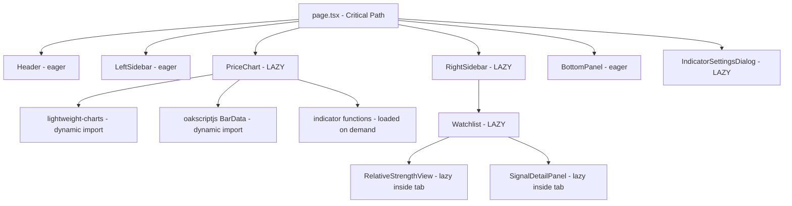

# 📦 Fase 2.2 — Bundle Splitting y Lazy Loading: Plan de Implementación

## Problema Actual

Todos los imports son estáticos — el browser descarga TODO el JavaScript antes de renderizar nada:
- `oakscriptjs` (~50KB) se importa en 6 archivos de indicadores + PriceChart
- `lightweight-charts` (~200KB) se importa en PriceChart + renderer
- `lightweight-charts-indicators` (~30KB) se importa en `lib/indicators/index.ts`
- Componentes pesados (PriceChart, Watchlist, IndicatorSettingsDialog) se cargan en el initial bundle

**Resultado**: First Paint lento porque el browser tiene que parsear ~300KB+ de JS antes de mostrar algo.

---

## Estrategia



---

## Pasos de Implementación

### Paso 1: Dynamic import de `oakscriptjs` en PriceChart

**Archivo**: `src/components/chart/PriceChart.tsx`

Actualmente importa directamente:
```tsx
import { BarData, type Bar } from "oakscriptjs";
```

**Cambio**: Extraer la lógica que usa `BarData` a un helper separado y usar `import()` dinámico dentro de los efectos que lo necesitan. Los **type imports** se quedan estáticos (no añaden al bundle), pero las **value imports** se hacen dinámicas.

```tsx
// Type imports quedan estáticos (zero cost)
import type { Bar } from "oakscriptjs";

// Value import se hace dinámico dentro del efecto
async function loadBarData(candles: Candle[]) {
  const { BarData } = await import("oakscriptjs");
  const bd = new BarData();
  candles.forEach(c => bd.push({ time: c.time, open: c.open, high: c.high, low: c.low, close: c.close, volume: c.volume }));
  return bd;
}
```

**Impacto**: ~50KB menos en el bundle inicial de PriceChart.

### Paso 2: Dynamic import de `lightweight-charts-indicators` en lib/indicators

**Archivo**: `src/lib/indicators/index.ts`

Actualmente importa todo al top-level:
```ts
import { SMA as LibSMA, EMA as LibEMA, RSI as LibRSI, MACD as LibMACD, ATR as LibATR, BollingerBands as LibBB, Stochastic as LibSTOCH } from "lightweight-charts-indicators";
```

**Cambio**: Lazy-load las clases de indicadores dentro de cada función wrapper:

```ts
export async function sma(candles: Candle[], period: number): Promise<IndicatorPoint[]> {
  const { SMA: LibSMA } = await import("lightweight-charts-indicators");
  // ... cálculo
}
```

**Nota**: Esto cambia la API de sync a async. Los consumidores (PriceChart) necesitarán `await` o `.then()`. Alternativa: mantener API sync pero usar un **preload pattern** — cargar el módulo al inicio y cachear la referencia.

**Decisión recomendada**: Preload pattern para mantener API sync:

```ts
let indicatorsModule: typeof import("lightweight-charts-indicators") | null = null;

async function preloadIndicators() {
  if (!indicatorsModule) {
    indicatorsModule = await import("lightweight-charts-indicators");
  }
  return indicatorsModule;
}

// Preload al montar el componente chart
// Las funciones sync usan indicatorsModule si está cargado, fallback a import dinámico
```

### Paso 3: React.lazy para componentes pesados en page.tsx

**Archivo**: `src/app/page.tsx`

Actualmente todo es import estático:
```tsx
import { PriceChart } from "@/components/chart/PriceChart";
import { IndicatorSettingsDialog } from "@/components/chart/IndicatorSettingsDialog";
```

**Cambio**: Usar `next/dynamic` (wrapper de Next.js sobre React.lazy):

```tsx
import dynamic from "next/dynamic";

const PriceChart = dynamic(() => import("@/components/chart/PriceChart").then(m => ({ default: m.PriceChart })), {
  loading: () => <ChartSkeleton />,
  ssr: false, // lightweight-charts no funciona en SSR
});

const IndicatorSettingsDialog = dynamic(() => import("@/components/chart/IndicatorSettingsDialog").then(m => ({ default: m.IndicatorSettingsDialog })), {
  ssr: false,
});

const RightSidebar = dynamic(() => import("@/components/layout/RightSidebar").then(m => ({ default: m.RightSidebar })), {
  loading: () => <SidebarSkeleton />,
});
```

**Nota**: `next/dynamic` es preferido sobre `React.lazy` en Next.js porque maneja SSR correctamente.

### Paso 4: Skeleton Loaders para Suspense boundaries

**Archivo nuevo**: `src/components/ui/skeleton.tsx`

Crear componentes skeleton reutilizables:

```tsx
export function ChartSkeleton() {
  return (
    <div className="flex h-full items-center justify-center bg-tv-bg">
      <div className="flex flex-col items-center gap-3">
        <div className="h-8 w-48 animate-pulse rounded bg-tv-panel" />
        <div className="h-[400px] w-full animate-pulse rounded bg-tv-panel" />
      </div>
    </div>
  );
}

export function SidebarSkeleton() {
  return (
    <div className="w-72 animate-pulse bg-tv-panel p-3">
      <div className="h-6 w-32 rounded bg-tv-border" />
      <div className="mt-4 space-y-2">
        {Array.from({ length: 8 }).map((_, i) => (
          <div key={i} className="h-8 rounded bg-tv-border" />
        ))}
      </div>
    </div>
  );
}
```

### Paso 5: Lazy-load Watchlist y sub-componentes

**Archivo**: `src/components/layout/RightSidebar.tsx`

```tsx
import dynamic from "next/dynamic";

const Watchlist = dynamic(() => import("@/components/watchlist/Watchlist").then(m => ({ default: m.Watchlist })), {
  loading: () => <SidebarSkeleton />,
});
```

Dentro de Watchlist, los tabs de RelativeStrengthView y SignalDetailPanel también pueden ser lazy:

```tsx
const RelativeStrengthView = dynamic(() => import("./RelativeStrengthView").then(m => ({ default: m.RelativeStrengthView })));
const SignalDetailPanel = dynamic(() => import("./SignalDetailPanel").then(m => ({ default: m.SignalDetailPanel })));
```

### Paso 6: webpack-bundle-analyzer

**Instalación**:
```bash
npm install --save-dev webpack-bundle-analyzer
```

**Configuración** en `next.config.ts`:
```ts
import type { NextConfig } from "next";

const withBundleAnalyzer = require("@next/bundle-analyzer")({
  enabled: process.env.ANALYZE === "true",
});

const nextConfig: NextConfig = {};

export default withBundleAnalyzer(nextConfig);
```

**Uso**:
```bash
ANALYZE=true npm run build
```

Esto abre un treemap visual del bundle para identificar chunks y oportunidades de splitting.

---

## Archivos a Modificar

| Archivo | Cambio |
|---------|--------|
| `src/app/page.tsx` | `next/dynamic` para PriceChart, IndicatorSettingsDialog, RightSidebar |
| `src/components/chart/PriceChart.tsx` | Dynamic import de `oakscriptjs` BarData |
| `src/components/layout/RightSidebar.tsx` | `next/dynamic` para Watchlist |
| `src/components/watchlist/Watchlist.tsx` | `next/dynamic` para RelativeStrengthView, SignalDetailPanel |
| `src/lib/indicators/index.ts` | Preload pattern para `lightweight-charts-indicators` |
| `next.config.ts` | Agregar `@next/bundle-analyzer` |
| `package.json` | Agregar `webpack-bundle-analyzer` devDependency |
| `src/components/ui/skeleton.tsx` | **NUEVO** — ChartSkeleton, SidebarSkeleton |

---

## Orden de Ejecución

1. **Paso 6 primero** — Instalar bundle-analyzer y capturar baseline (para comparar antes/después)
2. **Paso 3** — `next/dynamic` en `page.tsx` (mayor impacto, menor riesgo)
3. **Paso 4** — Skeleton loaders (necesarios para los Suspense boundaries)
4. **Paso 5** — Lazy-load Watchlist y sub-componentes
5. **Paso 1** — Dynamic import oakscriptjs en PriceChart
6. **Paso 2** — Preload pattern para lightweight-charts-indicators
7. **Verificación** — `ANALYZE=true npm run build` + `npm run test`

---

## Riesgos y Mitigaciones

| Riesgo | Mitigación |
|--------|-----------|
| `next/dynamic` con named exports requiere `.then(m => ({ default: m.X }))` | Usar siempre el patrón de re-export |
| `lightweight-charts` no funciona en SSR | `ssr: false` en `next/dynamic` |
| Cambiar indicators a async rompe API existente | Usar preload pattern, no async API |
| Skeleton flash si carga muy rápido | `next/dynamic` solo muestra loading si toma >200ms |
| oakscriptjs type imports vs value imports | Types quedan estáticos, values dinámicos |
